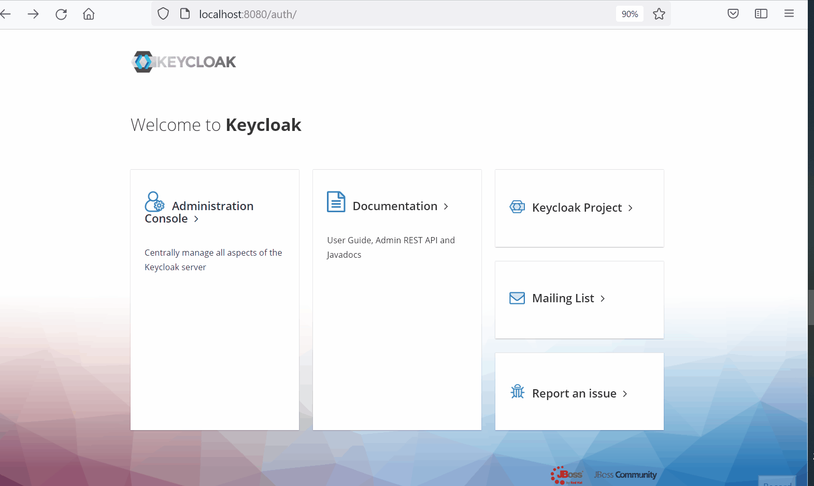

# Movie Application with OAuth2
This is simplest spring boot Movie application which provide the OAuth2 security using the library(OAuth2KeycloakLib) and keycloak authorization server.

## Sequence Diagram 
 
	
  

## Command for run the keycloak using docker compose 
`
	docker-compose up
`

## Keycloak UI
`
	http://localhost:8080
	
### Keycloak login screen
username: admin  
password: admin  
 
	
  

### Keycloak create realm 
 
	
  

### Keycloak create client
 
	
  

### Keycloak create role and user
 
	
  

## Movie application Rest Api
`
	http://localhost:8880/movies
`	

### Get the JWT token using postman
Request Body contains:-  
* grant_type:password
* scope:openid
* client_id:test_client
* client_secret:33a80087-2cff-4ed7-b8b4-6a7299e96b42
* username:rai
* password:password

 
	
  

### Movie Rest api call using postman
 
	
  

### Swagger Documentation Movie Rest api
you need to provide the token in the header for swagger documentation response in json.  
 
	
  

